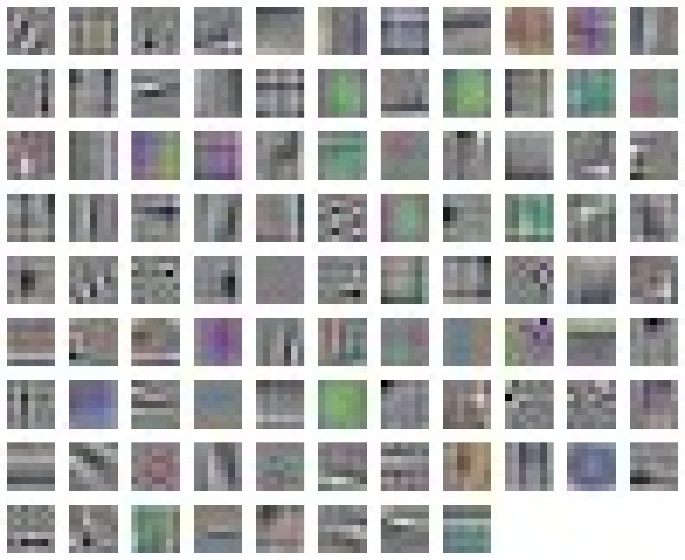
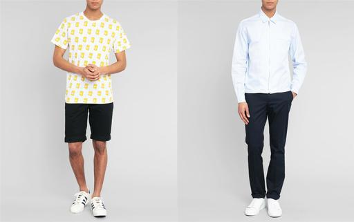

# Jigsaw CNN

Work in progress

A chainer implementation of self-supervised [jigsaw CNNs](https://arxiv.org/abs/1603.09246). The authors have published their [caffe implementation](https://github.com/MehdiNoroozi/JigsawPuzzleSolver)

# Patches

The jigsaw CNN learn a representation by reassembling an image from it's patches.


This is achieved by:

1. randomly cropping a square from the image.
2. segmenting the crop into 9 patches (with more random crops).
3. permuting the patches
4. predict what permutation was applied to the patches.


With the aim of learning about structure, colour and texture without labels.

# Usage

```
python -m jigsaw.train --gpu 3 "/path/to/train/*.jpg" "/path/to/test/*.jpg"
```

Note that the path globs must be quoted or the shell we expand them. Images will automatically
be rescaled, cropped and turned into patches at runtime. Check `--help` for more details. Training
on the cpu is not supported, you must specify a gpu ID. 

# Results



## KNN

If we match images based on similarity between pool5 / conv5 patch representations we end 
up with results like below where by we match on the model's face patch.



# Notes

To identify an `n-permutation` we only need `n-1` elements so I've made the task harder by randomly zero'ing one of the patches (i.e dropout for patches). Permutations are generated in a different manner than specified in the paper but the average hamming distance is almost the same at `0.873` (see scripts/perm-gen.py).

The architecture we use to generate patch representations is closer to
[ZFNet](https://arxiv.org/pdf/1311.2901v3) than
[AlexNet](https://papers.nips.cc/paper/4824-imagenet-classification-with-deep-convolutional-neural-networks.pdf)

Training could be made faster by precalculating batches. 
