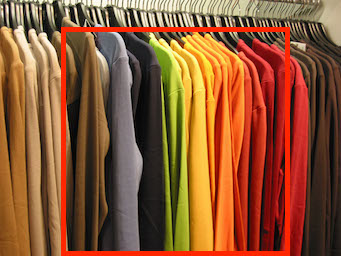
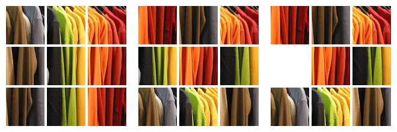

# Jigsaw CNN

Work in progress

A chainer implementation of self-supervised [jigsaw CNNs](https://arxiv.org/abs/1603.09246). The authors have published their [caffe implementation](https://github.com/MehdiNoroozi/JigsawPuzzleSolver)

# Patches

# Results

# Notes

To identify an `n-permutation` we only need `n-1` elements so I've made the task harder by randomly zero'ing one of the patches (i.e dropout for patches). Permutations are generated in a different manner than specified in the paper but the average hamming distance is almost the same at `0.873` (see scripts/perm-gen.py).

The architecture we use to generate patch representations is closer to
[ZFNet](https://arxiv.org/pdf/1311.2901v3) than
[AlexNet](https://papers.nips.cc/paper/4824-imagenet-classification-with-deep-convolutional-neural-networks.pdf)

Training could be made faster by precalculating batches. 
